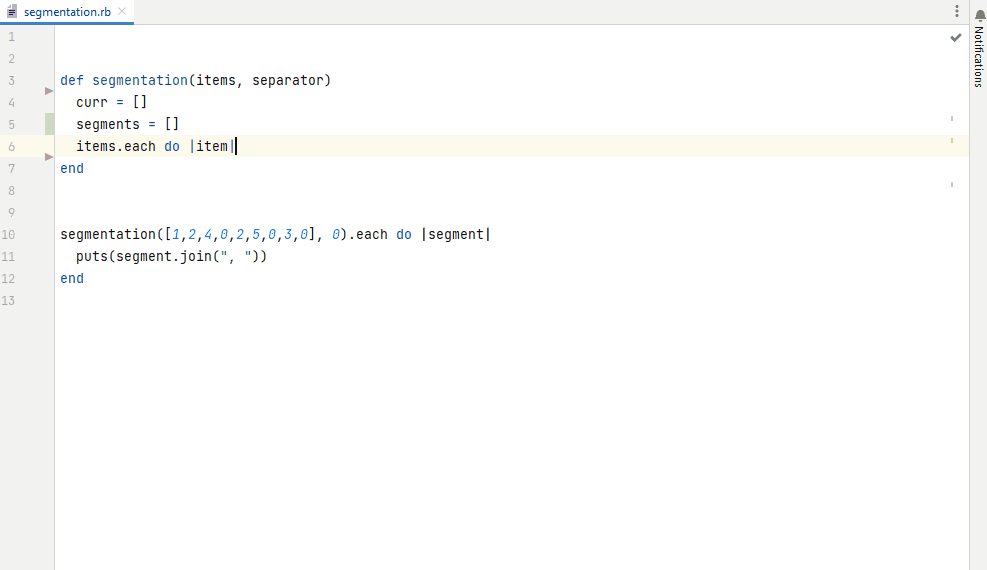
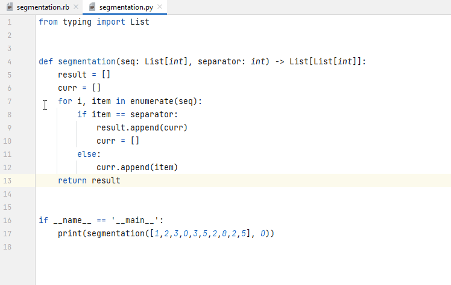
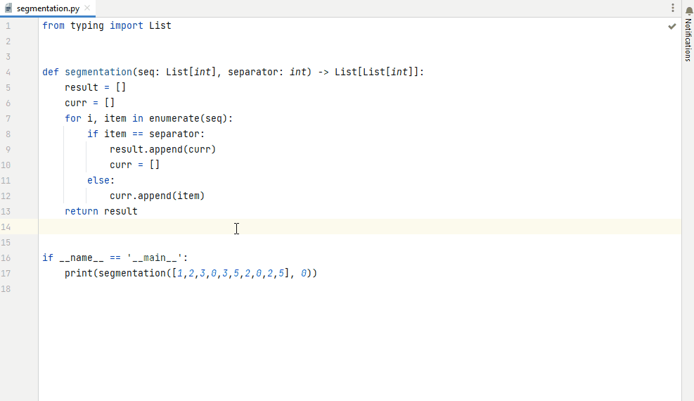

# AutoDev: LLM-Based Coding Assistance Functions

This repository contains two projects:

* The **AutoDev Python project** providing the core functionality (`./autodev`), including
  * auto-completion models (that can suggest completions based on the current editing context)
    * fine-tuning of completion models to teach them new languages (or to teach them about your libraries, your code style, etc.)
    * quantitative & qualitative evaluation
    * optimization of models for inference (including quantization) 

  * code-based assistance functions, where an instruction-following model is given a task based on an existing code snippet (e.g. reviewing code, adding comments or input checks, explaining code, etc.)
  * an inference service, which access to the above functions
  * question answering on document databases (including source code documents)
* A Java project implementing the **AutoDev IntellIJ IDEA plugin** which provides access to the coding assistance functions within JetBrains IDEs such as IntelliJ IDEA, PyCharm and others (`./idea-plugin`).

Please refer to the projects' individual README files for further information.

## AutoDev in Action

### Fine-Tuned Auto-Completion

Generating completions for the Ruby programming language based on a fine-tuned version of bigcode/santacoder, which originally knew only Python, Java and JavaScript:

### Assistance Functions Built on Instruction-Following Models

Adding input checks to a function:

Identifying potential problems in a piece of code:

