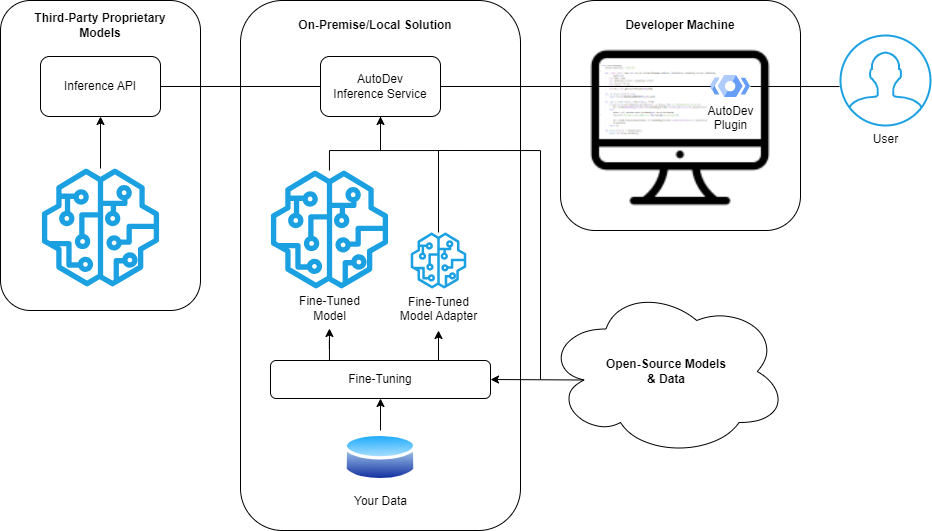

# AutoDev: LLM-Based Coding Assistance Functions

This repository contains two projects:

* The [**AutoDev Python project**](autodev/README.md) providing the core functionality (`./autodev`), including
  * auto-completion models (that can suggest completions based on the current editing context)
    * fine-tuning of completion models to teach them new languages (or to teach them about your libraries, your code style, etc.)
    * quantitative & qualitative evaluation
    * optimization of models for inference (including quantization) 

  * code-based assistance functions, where an instruction-following model is given a task based on an existing code snippet (e.g. reviewing code, adding comments or input checks, explaining code, etc.)
  * an inference service, which provides access to the above functions
  * question answering on document databases (including source code documents)
* A Java project implementing the [**AutoDev IntellIJ IDEA plugin**](idea-plugin/README.md) which provides access to the coding assistance functions within JetBrains IDEs such as IntelliJ IDEA, PyCharm and others (`./idea-plugin`).

Please refer to the projects' individual README files for further information (linked above).

## AutoDev in Action

### Fine-Tuned Auto-Completion

Generating completions for the Ruby programming language based on a fine-tuned version of bigcode/santacoder, which originally knew only Python, Java and JavaScript:

### Assistance Functions Built on Instruction-Following Models

Adding input checks to a function:

Identifying potential problems in a piece of code:

## Structural Overview

Here's a structural overview showing the main components and their interactions: 

* For auto-completion, the model is served directly by the AutoDev inference service, i.e. the model is always locally provided and is either an unmodified open-source model (from the [Hugging Face Hub](https://huggingface.co/docs/hub/index)) or a fine-tuned version thereof. Fine-tuning may use community data or our own data.
* For other assistance functions built on instruction-following models, you have the option of using either a (fine-tuned) open-source model, as in the previous case, or a proprietary model (such as ChatGPT). 